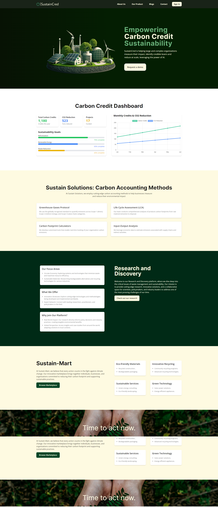
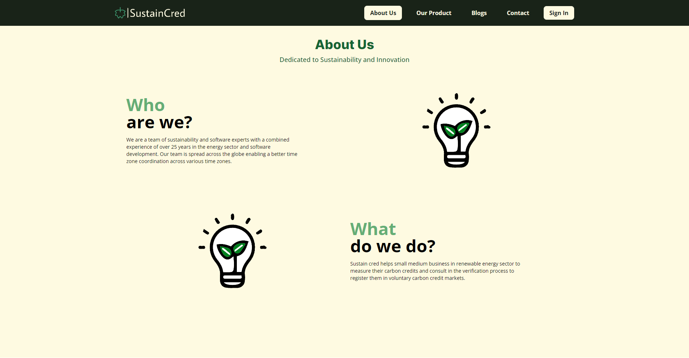
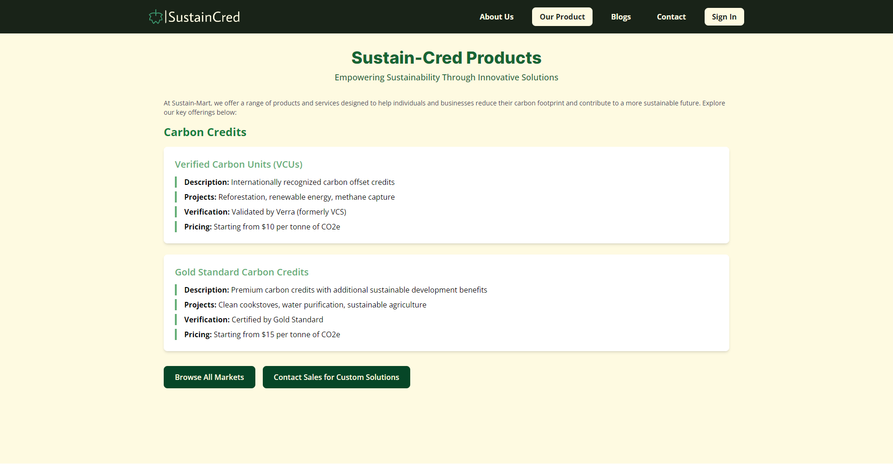
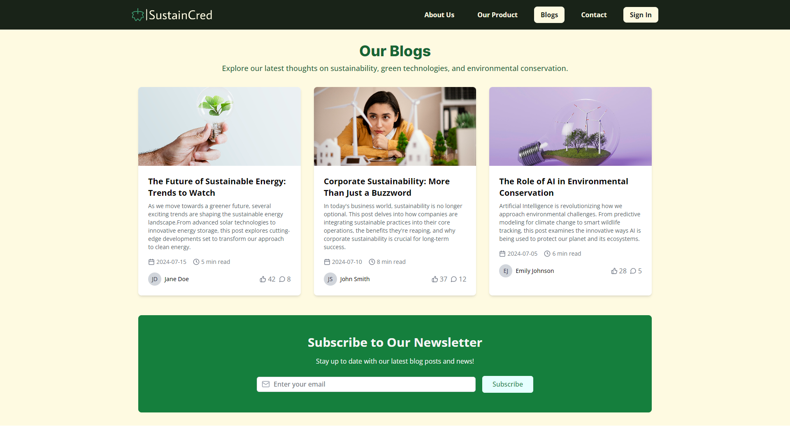

# Hi there 👋

## SustainCred Company Assignment

## About The Project

- [Website Link](https://energy-sustain.vercel.app/)

- This is just a clone.

- This is a company assignment for the SustainCred.

- It is a platform dedicated to empowering organizations to measure and reduce their carbon footprint using advanced AI-driven solutions. The website features a modern and professional design with a focus on sustainability and carbon credits.

## Technologies Used

- HTML
- CSS
- JavaScript
- React
- React Router
- Tailwind CSS
- Chart.js

## Features

- Home Page
- About Us Page
- Our Products Page
- Blogs Page
- Contact Us Page
- Sign In Page
- Mobile Responsive Website

## Screenshots

### 1. Home Page

### 2. About Us Page

### 3. Our Products Page

### 4. Blogs Page

## Figma File

I have attached the figma file for the website.
I just give it a try although I am not sure if it is good or not.

<!--  -->

## License

This project is licensed under the MIT License.

## Authors

[Abhijeet-Sharma](https://github.com/Abhijeet03s)
