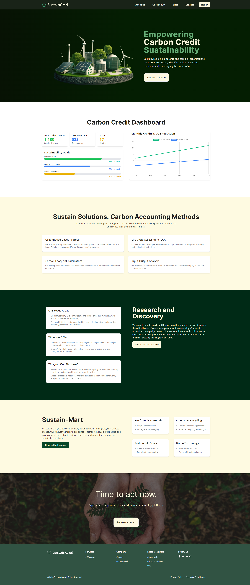
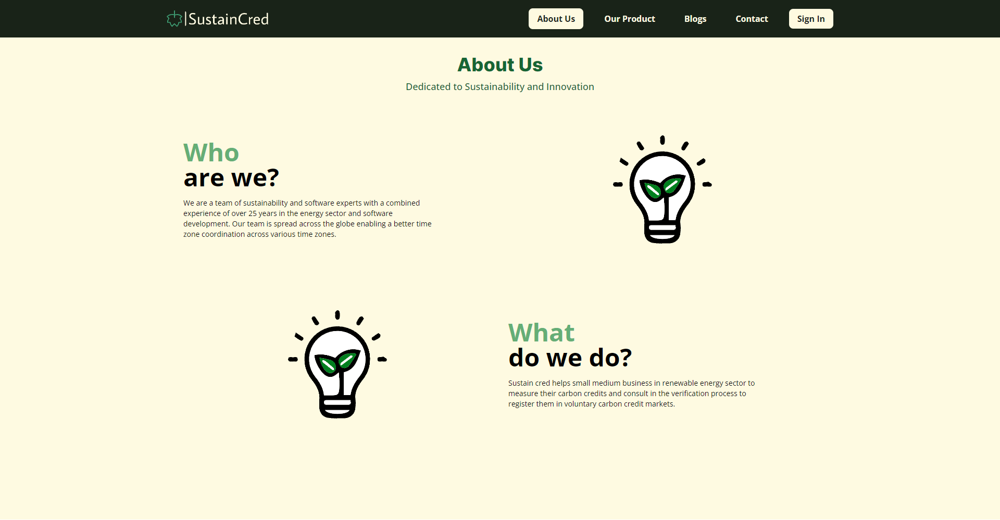
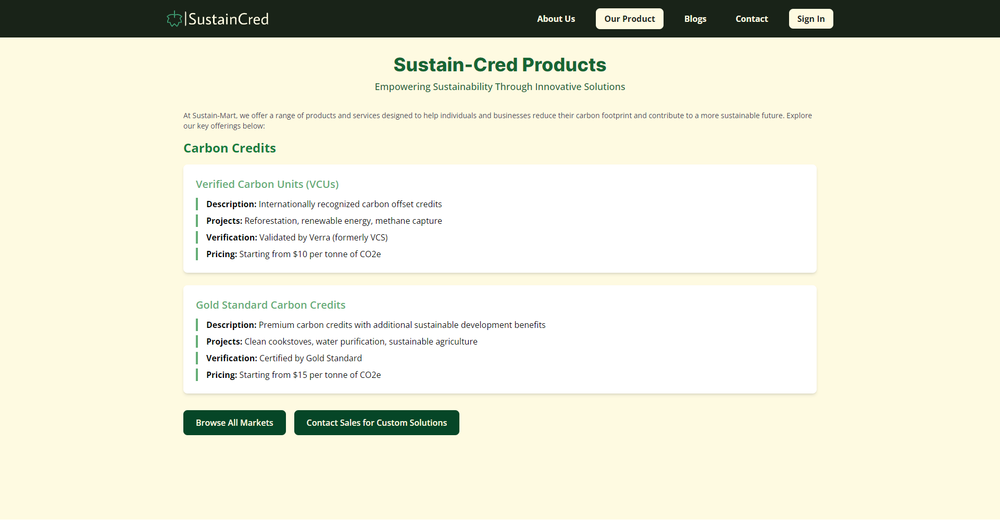
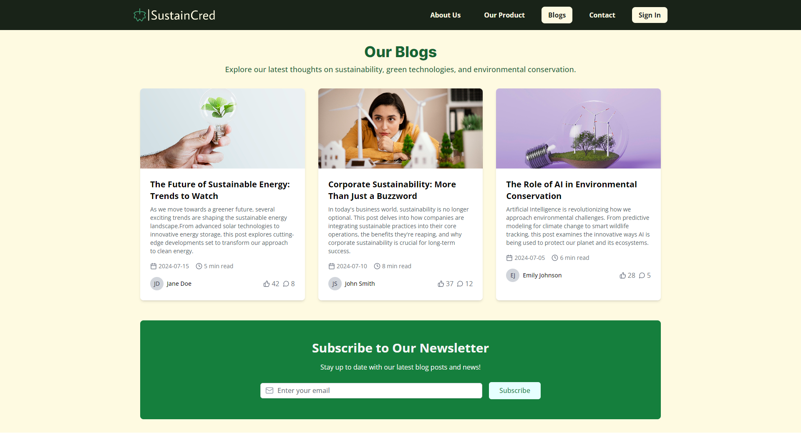
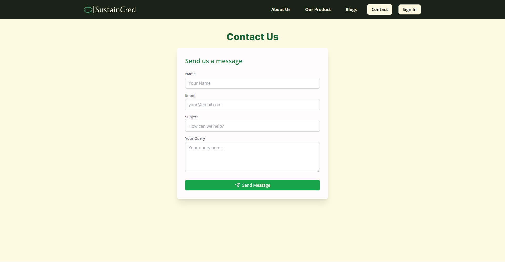

# Hi there 👋

## SustainCred Company Assignment

## About The Project

- **Website Link** - [Energy Sustain](https://energy-sustain.vercel.app/)

- **This is merely a variation of a clone.**

- This is a company assignment for the SustainCred.

- It is a platform dedicated to empowering organizations to measure and reduce their carbon footprint using advanced AI-driven solutions. The website features a modern and professional design with a focus on sustainability and carbon credits.

## Technologies Used

- HTML
- CSS
- JavaScript
- React
- React Router
- Tailwind CSS
- Chart.js
- Figma

## Features

- Home Page
- About Us Page
- Our Products Page
- Blogs Page
- Contact Us Page
- Sign In Page
- Mobile Responsive Website

## Screenshots

### 1. Home Page

### 2. About Us Page

### 3. Our Products Page

### 4. Blogs Page

### 4. Contact Us Page

## Figma File

[Figma File](https://www.figma.com/design/2elXsZPZimpT1OUajQbiE8/React-Project?node-id=0-1&t=NIoOUNKcRWnKJ5TC-1)

- I have attached the figma file for the website.
- I just give it a try although.

## Author👨‍💻

[Abhijeet-Sharma](https://github.com/Abhijeet03s)
